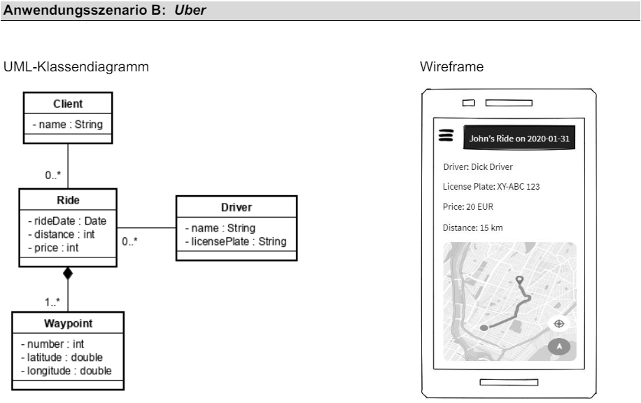

# DMG Projekt ⎯ [UBER Api](main.go)

<div style="position: relative; left: 5px;">
    
</div>

### Use by your own
1. Navigate into the project directory
2. Run the following command in your terminal:
```bash
go run main.go
```

> [!TIP]
> Run Project in [GoLand by JetBrains](https://www.jetbrains.com/de-de/go/) on MacOS or Linux to prevent problems

> [!IMPORTANT]
> Project requires `C Compiler` & [GoLang Compiler](https://go.dev/dl/) to start on Windows
